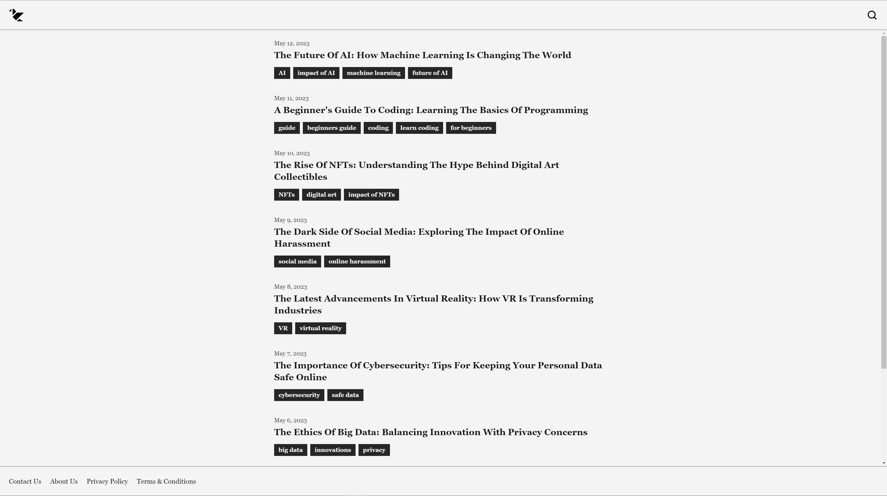

  

<h1 align="center">The Daily Chronicle News</h1>

## Table of contents

- [Table of contents](#table-of-contents)
- [About](#about)
- [Screenshots](#screenshots)
- [Built with](#built-with)
- [Links](#links)
- [License](#license)

## About

This project is a news website built with HTML and TailwindCSS that features some articles and a nice responsive design. It is made for a fictional news company called The Daily Chronicle and contains articles mainly about tech and AI. Fully functional, fully responsive

## Screenshots

## Built with

## Links

- [Live Preview](https://seesmof.github.io/the-daily-chronice-news/)

## License

This project is licensed under the [MIT License](./LICENSE).

<a href="#readme-top"><strong>Back to top</strong></a>

